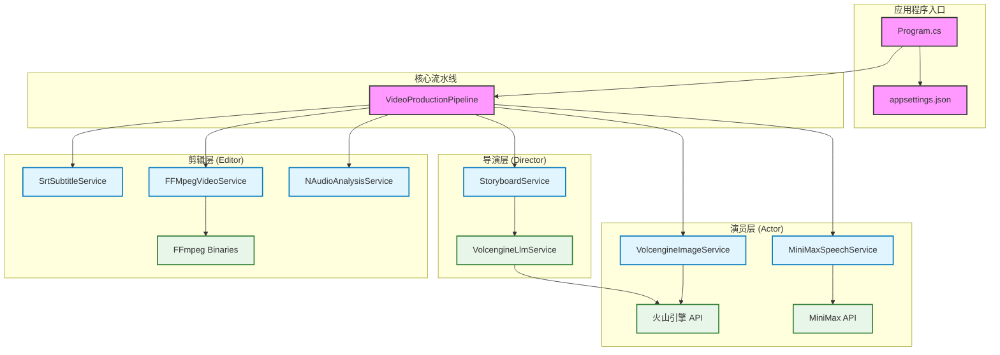

# AutoCinema.Pro

> 🎬 **文本生成图片视频+自动字幕** - 基于 AI 的自动化视频生成系统

[](https://dotnet.microsoft.com/)
[](LICENSE)

AutoCinema.Pro 是一个创新的自动化视频生成系统,采用**导演-演员-剪辑模型 (Director-Actor-Editor Model)**,能够将简单的文本故事自动转换为带有图片、语音和字幕的完整视频。

## ✨ 核心特性

- 🎭 **导演层 (Director)**: 使用 LLM 将故事文本智能拆解为结构化分镜脚本
- 🎨 **演员层 (Actor)**: 并行生成高质量图片和逼真语音
- ✂️ **剪辑层 (Editor)**: 自动合成视频、生成字幕并实现音画对齐
- 🔄 **弹性重试**: 内置 Polly 重试策略,确保 API 调用稳定性
- 📊 **进度追踪**: 实时反馈视频生成进度
- ⚙️ **灵活配置**: 支持多种 AI 服务提供商

## 🏗️ 系统架构



### 架构说明

#### 1. 导演层 (Director Layer)
- **StoryboardService**: 将用户的原始故事文本转换为结构化的分镜脚本
- **VolcengineLlmService**: 调用火山引擎的大语言模型 (Doubao),进行文本理解和分镜拆解

#### 2. 演员层 (Actor Layer)
- **VolcengineImageService**: 调用火山引擎 (Seedream) 生成高质量的场景图片
- **MiniMaxSpeechService**: 调用 MiniMax TTS 生成逼真的语音旁白
- 支持并发控制和降级策略

#### 3. 剪辑层 (Editor Layer)
- **SrtSubtitleService**: 生成 SRT 字幕文件,确保字幕与语音时间轴对齐
- **FFMpegVideoService**: 使用 FFmpeg 将图片、语音和字幕合成最终的视频文件
- **NAudioAnalysisService**: 分析音频文件的时长,用于精确的时间轴控制

## 📁 项目结构

```
AutoCinema/
├── src/
│   ├── AutoCinema.Pro/              # 主应用程序
│   │   ├── Configuration/           # 配置选项类
│   │   │   ├── LlmOptions.cs
│   │   │   ├── VolcengineOptions.cs
│   │   │   ├── MiniMaxOptions.cs
│   │   │   └── PipelineOptions.cs
│   │   ├── Infrastructure/          # 基础设施
│   │   │   └── Resilience/
│   │   │       └── PollyPolicies.cs # 重试策略
│   │   ├── Models/                  # 领域模型
│   │   │   ├── VideoProject.cs      # 视频项目
│   │   │   ├── Storyboard.cs        # 分镜脚本
│   │   │   ├── Scene.cs             # 场景
│   │   │   └── GeneratedAsset.cs    # 生成的素材
│   │   ├── Services/
│   │   │   ├── Director/            # 导演层服务
│   │   │   │   ├── IStoryboardService.cs
│   │   │   │   ├── StoryboardService.cs
│   │   │   │   └── VolcengineLlmService.cs
│   │   │   ├── Actor/               # 演员层服务
│   │   │   │   ├── IImageGenerationService.cs
│   │   │   │   ├── VolcengineImageService.cs
│   │   │   │   ├── ISpeechGenerationService.cs
│   │   │   │   └── MiniMaxSpeechService.cs
│   │   │   └── Editor/              # 剪辑层服务
│   │   │       ├── IAudioAnalysisService.cs
│   │   │       ├── NAudioAnalysisService.cs
│   │   │       ├── ISubtitleService.cs
│   │   │       ├── SrtSubtitleService.cs
│   │   │       ├── IVideoCompositionService.cs
│   │   │       └── FFMpegVideoService.cs
│   │   ├── Pipeline/                # 流水线编排
│   │   │   ├── IVideoProductionPipeline.cs
│   │   │   └── VideoProductionPipeline.cs
│   │   ├── Program.cs               # 应用入口
│   │   ├── appsettings.json         # 配置文件
│   │   └── AutoCinema.Pro.csproj    # 项目文件
│   └── ffmpeg/                      # FFmpeg 可执行文件
│       ├── ffmpeg.exe
│       └── ffprobe.exe
├── AutoCinema.Pro.sln               # 解决方案文件
├── architecture.md                  # 架构文档
├── walkthrough.md                   # 项目演练
└── README.md                        # 本文件
```

## 🚀 快速开始

### 前置要求

- [.NET 8.0 SDK](https://dotnet.microsoft.com/download/dotnet/8.0) 或更高版本
- [FFmpeg](https://ffmpeg.org/download.html) (已包含在 `src/ffmpeg` 目录中)
- 以下 API 密钥:
  - 火山引擎 Ark API 密钥 (用于 LLM 和图片生成)
  - MiniMax API 密钥 (用于语音合成)

### 安装步骤

1. **克隆仓库**

```bash
git clone https://github.com/helihui/AutoCinema.git
cd AutoCinema
```

2. **配置 API 密钥**

编辑 `src/AutoCinema.Pro/appsettings.json`,填入你的 API 密钥:

```json
{
  "Llm": {
    "Provider": "Volcengine",
    "ApiKey": "你的火山引擎API密钥",
    "Model": "doubao-seed-1-6-251015",
    "Endpoint": "https://ark.cn-beijing.volces.com/api/v3/responses"
  },
  "Volcengine": {
    "ApiKey": "你的火山引擎API密钥",
    "Endpoint": "https://ark.cn-beijing.volces.com/api/v3/images/generations",
    "Model": "doubao-seedream-4-5-251128"
  },
  "MiniMax": {
    "ApiKey": "你的MiniMax API密钥",
    "Endpoint": "https://api.minimaxi.com/v1/t2a_v2",
    "Model": "speech-2.6-hd"
  }
}
```

3. **构建项目**

```bash
dotnet build
```

4. **运行程序**

```bash
cd src/AutoCinema.Pro
dotnet run
```

### 自定义故事

你可以在 `appsettings.json` 中修改演示项目的配置:

```json
{
  "Pipeline": {
    "DemoProject": {
      "Title": "你的视频标题",
      "StoryText": "你的故事文本..."
    },
    "DefaultVisualStyle": "Cinematic, high quality, detailed",
    "DefaultCharacterPrompt": "你的角色描述..."
  }
}
```

## 🎯 使用示例

### 基本用法

```csharp
// 创建视频项目
var project = new VideoProject
{
    ProjectId = Guid.NewGuid().ToString("N")[..8],
    Title = "我的第一个视频",
    OutputDirectory = "./output/my-video",
    RawStoryText = "小猫在月球上探险,发现了神秘的宝藏...",
    BaseVisualStyle = "Cinematic, high quality"
};

// 获取流水线服务
var pipeline = host.Services.GetRequiredService<IVideoProductionPipeline>();

// 生成视频
var progress = new Progress<ProductionProgress>(p =>
{
    Console.WriteLine($"[{p.Percentage}%] {p.Stage} - {p.Step}");
});

var outputPath = await pipeline.ProduceAsync(project, progress);
Console.WriteLine($"视频已生成: {outputPath}");
```

### 输出示例

程序运行时会显示详细的进度信息:

```
╔════════════════════════════════════════════════════════╗
║          AutoCinema.Pro - 自动化视频生成系统           ║
║                     Director-Actor-Editor Model        ║
╚════════════════════════════════════════════════════════╝

[  0%] 导演层 - 正在解析故事文本...
[ 10%] 导演层 - 已生成 3 个场景
[ 20%] 演员层 - 正在生成场景 1 的图片...
[ 30%] 演员层 - 正在生成场景 1 的语音...
[ 50%] 演员层 - 所有素材生成完成
[ 70%] 剪辑层 - 正在生成字幕文件...
[ 90%] 剪辑层 - 正在合成最终视频...
[100%] 完成 - 视频生成成功

╔════════════════════════════════════════════════════════╗
║                    视频生成完成!                       ║
╚════════════════════════════════════════════════════════╝
输出文件: E:\output\demo\星际小猫的航行.mp4
```

## 🛠️ 技术栈

| 组件 | 技术 | 版本 |
|------|------|------|
| 运行时 | .NET | 8.0 |
| 语言 | C# | 12 |
| LLM 服务 | 火山引擎 Doubao | - |
| 图片生成 | 火山引擎 Seedream | - |
| 语音合成 | MiniMax TTS | speech-2.6-hd |
| 音频分析 | NAudio | 2.2.1 |
| 视频处理 | FFMpegCore | 5.1.0 |
| 弹性重试 | Polly | 8.4.0 |
| 依赖注入 | Microsoft.Extensions.Hosting | 8.0.0 |

## ⚙️ 配置说明

### LLM 配置

```json
{
  "Llm": {
    "Provider": "Volcengine",        // LLM 提供商
    "ApiKey": "your-api-key",        // API 密钥
    "Model": "doubao-seed-1-6-251015", // 模型名称
    "Temperature": 0.7,              // 温度参数 (0-1)
    "MaxTokens": 4000                // 最大 token 数
  }
}
```

### 图片生成配置

```json
{
  "Volcengine": {
    "ApiKey": "your-api-key",
    "Model": "doubao-seedream-4-5-251128",
    "ImageSize": "2K",               // 图片尺寸: 1K, 2K, 4K
    "MaxConcurrency": 3,             // 最大并发数
    "Watermark": false               // 是否添加水印
  }
}
```

### 语音合成配置

```json
{
  "MiniMax": {
    "ApiKey": "your-api-key",
    "Model": "speech-2.6-hd",
    "VoiceId": "ttv-voice-xxx",      // 音色 ID
    "Speed": 1.0,                    // 语速 (0.5-2.0)
    "Volume": 1.0,                   // 音量 (0.1-10.0)
    "Emotion": "happy",              // 情感: happy, sad, angry, etc.
    "SampleRate": 32000,             // 采样率
    "Format": "mp3"                  // 输出格式
  }
}
```

### 流水线配置

```json
{
  "Pipeline": {
    "DefaultVisualStyle": "Cinematic, high quality, detailed",
    "DefaultCharacterPrompt": "角色一致性描述...",
    "TempDirectory": "./temp",       // 临时文件目录
    "OutputDirectory": "./output",   // 输出目录
    "FFmpegDirectory": "../ffmpeg"   // FFmpeg 路径
  }
}
```

## 📊 工作流程

1. **导演阶段**: 
   - 接收用户输入的故事文本
   - 调用 LLM 分析并拆解为多个场景
   - 为每个场景生成视觉描述和语音文本

2. **演员阶段**:
   - 并行生成每个场景的图片 (使用 Seedream)
   - 并行生成每个场景的语音 (使用 MiniMax TTS)
   - 保存所有生成的素材到临时目录

3. **剪辑阶段**:
   - 分析每段语音的时长
   - 生成与语音对齐的 SRT 字幕文件
   - 使用 FFmpeg 合成图片、语音和字幕
   - 输出最终的 MP4 视频文件

## 🔧 故障排除

### 常见问题

**Q: 提示 "未找到 FFmpeg"**

A: 确保 `src/ffmpeg` 目录中包含 `ffmpeg.exe` 和 `ffprobe.exe`,或者在系统 PATH 中安装了 FFmpeg。

**Q: API 调用失败**

A: 检查以下内容:
- API 密钥是否正确
- 网络连接是否正常
- API 配额是否充足
- 查看日志获取详细错误信息

**Q: 生成的视频没有字幕**

A: 确保:
- 语音文件生成成功
- 字幕服务正常工作
- FFmpeg 支持字幕烧录 (需要 libass)

**Q: 图片生成失败**

A: 系统会自动降级到占位图模式,检查:
- 火山引擎 API 配额
- 提示词是否符合内容安全规范
- 网络连接稳定性

## 🤝 贡献指南

欢迎贡献代码、报告问题或提出新功能建议!

1. Fork 本仓库
2. 创建你的特性分支 (`git checkout -b feature/AmazingFeature`)
3. 提交你的更改 (`git commit -m 'Add some AmazingFeature'`)
4. 推送到分支 (`git push origin feature/AmazingFeature`)
5. 开启一个 Pull Request

## 📝 开发路线图

- [ ] 支持更多 LLM 提供商 (OpenAI, Anthropic, etc.)
- [ ] 添加 Web API 接口
- [ ] 实现背景音乐混音功能
- [ ] 支持更多视频转场效果
- [ ] 添加视频模板系统
- [ ] 实现批量视频生成
- [ ] 支持多语言字幕
- [ ] 添加视频预览功能

## 📄 许可证

本项目采用 MIT 许可证 - 详见 [LICENSE](LICENSE) 文件

## 🙏 致谢

- [火山引擎](https://www.volcengine.com/) - 提供 LLM 和图片生成服务
- [MiniMax](https://www.minimaxi.com/) - 提供语音合成服务
- [FFmpeg](https://ffmpeg.org/) - 强大的多媒体处理工具
- [NAudio](https://github.com/naudio/NAudio) - .NET 音频处理库

## 📧 联系方式

如有问题或建议,请通过以下方式联系:

- 提交 [Issue](https://github.com/helihui/AutoCinema/issues)
- 发起 [Discussion](https://github.com/helihui/AutoCinema/discussions)

---

⭐ 如果这个项目对你有帮助,请给它一个星标!
