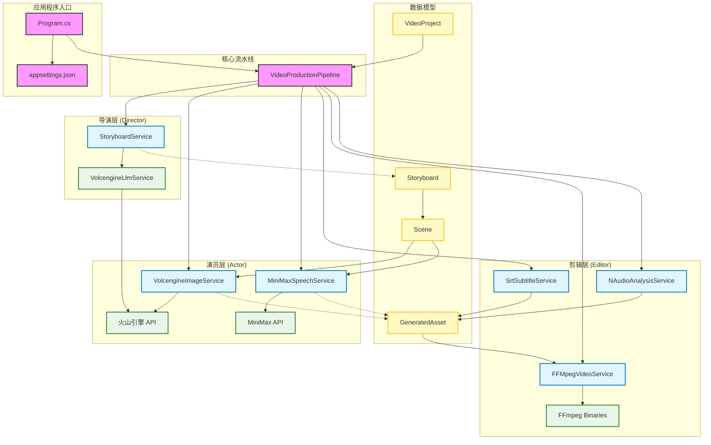

# AutoCinema.Pro 系统架构图

## 架构说明

### 1. 核心流水线 (Pipeline)

- **VideoProductionPipeline**: 系统的核心控制器，负责编排整个视频制作流程。它按顺序调用导演、演员和剪辑层的服务。

### 2. 导演层 (Director Layer)

- **StoryboardService**: 负责将用户的原始故事文本转换为结构化的分镜脚本。
- **VolcengineLlmService**: 调用火山引擎的大语言模型 (Doubao)，进行文本理解和分镜拆解。

### 3. 演员层 (Actor Layer)

- **VolcengineImageService**: 调用火山引擎 (Seedream) 生成高质量的场景图片。
- **MiniMaxSpeechService**: 调用 MiniMax TTS 生成逼真的语音旁白。

### 4. 剪辑层 (Editor Layer)

- **SrtSubtitleService**: 生成 SRT 字幕文件，确保字幕与语音时间轴对齐。
- **FFMpegVideoService**: 使用 FFmpeg 将图片、语音和字幕合成最终的视频文件。
- **NAudioAnalysisService**: 分析音频文件的时长，用于精确的时间轴控制。

### 5. 外部依赖 (External)

- **火山引擎 API**: 提供 LLM 和图片生成能力。
- **MiniMax API**: 提供语音合成能力。
- **FFmpeg**: 强大的多媒体处理工具，用于视频编码和合成。
